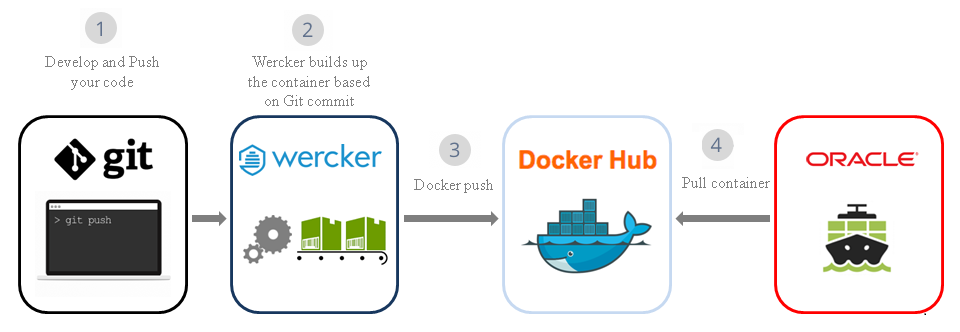

## PHP Example with [Wercker](http://wercker.com) integration


This example shows how to build PHP container packaged application using Wercker and deploy to Oracle Container Cloud Service for Continuous Deployment

### About this tutorial ###
**Wercker** is a Docker-Native CI/CD  Automation platform for Kubernetes & Microservice Deployments. Wercker is integrated with Docker containers, which package up application code and can be easily moved from server to server. Each build artifact can be a Docker container. The user can take the container from the Docker Hub or his private registry and build the code before shipping it. Its SaaS platform enables developers to test and deploy code often. They can push software updates incrementally as they are ready, rather than in bundled dumps. It makes it easier for coders to practice continuous integration, a software engineering practice in which each change a developer makes to the codebase is constantly tested in the process so that software doesn’t break when it goes live.

**Oracle Container Cloud Service** provides an easy and quick way to create an enterprise-grade container infrastructure. It delivers comprehensive tooling to compose, deploy, orchestrate and manage Docker container-based applications on the Oracle Public Cloud. It is designed to provision a ready to run containerized infrastructure quickly, that can be used as a test infrastructure, with a limited lifespan, or operated as a production environment for long running container applications.

Oracle Container Cloud Service provides feature called stack. The stack comprises all of the necessary configuration for running a set of services in a coordinated way, managed as a single entity, plus default deployment options. Note that stacks themselves are neither containers nor images running in containers, but rather are high-level configuration objects that you can create, deploy, and manage using Oracle Container Cloud Service.

In this example, stack contains a sample PHP application.

**Architecture**


This tutorial demonstrates how to:

- create Wercker application (CI/CD) to build, package and push PHP sample application to Docker public repository
- create Oracle Container Cloud Service based on containerized PHP sample application
- deploy stack to Oracle Container Cloud Service

### Prerequisites ###

- [Github](https://github.com) account
- [Oracle Public Cloud Service](https://cloud.oracle.com) account including Container Cloud Service
- [Docker](https://cloud.docker.com/) account to have Docker registry.

----


#### Set Continuous Deployment with [Wercker](http://wercker.com) 

1) Fork the repo `https://github.com/leobarros79/wercker-php-starter.git` to your Gihub account

2) Clone the repo:

```
$ git clone https://github.com/your_github_account/example-guestbook-wercker.git
```

3) Create a new [Wercker App](http://devcenter.wercker.com/docs/web-interface/adding-a-new-application.html) and connect to your App's Github repo

4) Under App's [Settings->Environment variables](http://devcenter.wercker.com/docs/environment-variables/creating-env-vars.html) create the values below:

```
DOCKER_USERNAME: dockerhub or other hosted docker registry account name
DOCKER_PASSWORD: your docker registry account password
DOCKER_REPOSITORY: your docker repository e.g. your_docker_hub_user_name/wercker-demo-app
```
The `Environment variables` above will be used by Wercker App you have created reading pipeline steps from the  [wercker.yml](wercker.yml) in your App's repository


5) Make changes to your code, push to Github and Wercker will do the following:

```
- build the docker image
- tag it
- push to your docker registry repository
- pull the new docker image on your remote Deis Workflow
```